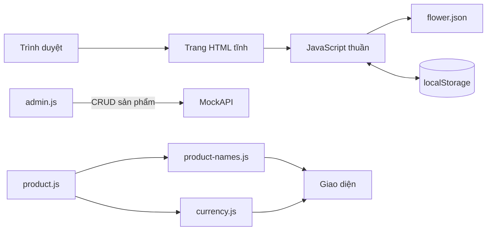

# casual-metal-9545
netlify link - https://genuine-malabi-a05086.netlify.app/

## Kiến trúc hệ thống

### Tổng quan

Đây là ứng dụng frontend tĩnh, dùng HTML, CSS và JavaScript thuần. Không có máy chủ ứng dụng riêng hoặc bước build. Các trang chạy trong trình duyệt; dữ liệu sản phẩm mẫu được tải từ `flower.json`, còn một số trạng thái được lưu trong `localStorage`.

### Các khu vực chính

| Khu vực | Tệp tiêu biểu | Trách nhiệm |
| --- | --- | --- |
| Trang chủ | `index.html`, `index.css` | Nội dung giới thiệu, danh mục và điều hướng |
| Danh mục hoa | `product.html`, `product.js`, `product.css` | Tải catalog, tìm kiếm, lọc, sắp xếp và thêm sản phẩm |
| Wishlist | `wish.html`, `wish.js`, `wish.css` | Hiển thị, thêm vào giỏ và xóa sản phẩm yêu thích |
| Giỏ hàng | `cart.html`, `styles/cart.css` | Cập nhật số lượng, xóa sản phẩm và tính tổng |
| Thanh toán | `checkout.html`, `placeorder.html` | Hiển thị thông tin giao hàng, phương thức thanh toán và xác nhận đơn |
| Tài khoản demo | `login.html`, `login.js`, `account.html` | Đăng ký/đăng nhập, xem hồ sơ và đăng xuất |
| Quản trị sản phẩm | `admin.html`, `admin.js`, `admin.css` | Đọc, thêm, sửa và xóa sản phẩm qua MockAPI |

### Dữ liệu và tiền tệ

- `flower.json` chứa catalog mẫu; `product.js` đọc tệp này qua `fetch`, vì vậy cần mở ứng dụng qua HTTP thay vì mở trực tiếp bằng `file://`.
- `cart`, `wish`, `usersData` và `loggedUser` được lưu trong `localStorage` của trình duyệt. Dữ liệu này không đồng bộ giữa thiết bị hoặc người dùng.
- Đăng nhập email/mật khẩu dùng Firebase Authentication khi provider được bật. Nếu Firebase chưa bật Email/Password (hoặc chưa cấu hình), website lưu tài khoản demo trong `localStorage` để dùng trên cùng trình duyệt; dữ liệu không đồng bộ và mật khẩu demo không được mã hóa, vì vậy không dùng mật khẩu thật cho chế độ này. Tài khoản demo cũ cũng được thử trên đúng trình duyệt đã lưu tài khoản đó.
- Đăng nhập Google dùng Firebase Authentication và cần bật Google provider, cấu hình Firebase Web App cùng domain được phép trong Firebase Console.
- Nút tài khoản trên các trang cửa hàng mở trang hồ sơ khi đã đăng nhập; nếu chưa có phiên thì mở trang đăng nhập.
- Checkout hiện là luồng minh họa phía frontend; không có xử lý thanh toán hoặc lưu đơn hàng phía máy chủ.
- `admin.js` gọi API MockAPI riêng để CRUD catalog quản trị.
- `product-names.js` chỉ ánh xạ tên sản phẩm khi hiển thị. `currency.js` định dạng giá catalog sang VND; catalog/API tiếp tục lưu giá nguồn bằng USD. Tỷ giá là giá trị snapshot cấu hình trong mã nguồn.

### Chạy và triển khai

Vì ứng dụng tĩnh có tải JSON bằng `fetch`, hãy chạy qua máy chủ HTTP cục bộ. Bản triển khai hiện có trên Netlify: https://genuine-malabi-a05086.netlify.app/.

### Cấu hình Firebase Authentication

1. Tạo Firebase project và đăng ký Web App trong Firebase Console.
2. Vào **Authentication → Sign-in method**, bật **Email/Password** và **Google**.
3. Trong **Authentication → Settings → Authorized domains**, thêm domain triển khai (và `localhost` khi phát triển cục bộ).
4. Sao chép Firebase Web App config vào `firebase-config.js`. Firebase web config được dùng ở client; bảo vệ dữ liệu bằng cấu hình provider, Authorized domains và quy tắc bảo mật dịch vụ, không coi config này là bí mật.
5. Chạy website qua HTTP/HTTPS. Khi đã điền cấu hình, đăng ký/đăng nhập email và nút Google sẽ sử dụng Firebase; tài khoản Google luôn được tạo với vai trò khách hàng, không phải admin.

Khi chưa điền cấu hình Firebase, nút Google sẽ giải thích cấu hình còn thiếu; chế độ tài khoản cục bộ tiếp tục hoạt động như bản demo.

# Landing Page 

Hear you can see the landing page of our project :

# Sign-In /Sign -Up

# Product page

# Search Option

# WishList

# Cart Page

# Order Page

# Checkout page

